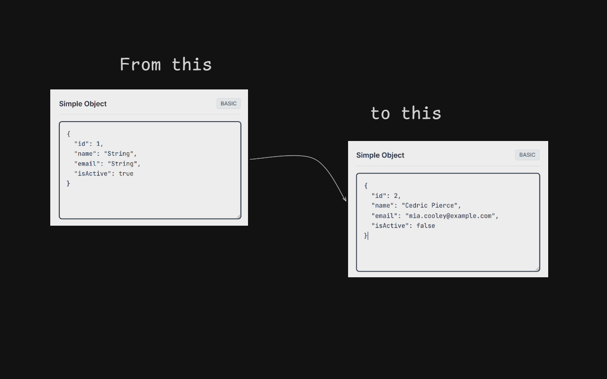

# Json Filler

> ⚠️ **Note**
>
> The extension is currently under review. Please stay tuned.
>
> 

**Json Filler** is a Chrome extension designed to boost developer productivity by automatically filling JSON inputs (like in Swagger UI) with realistic, context-aware dummy data.

It recursively parses your JSON schema and generates smart data based on keys (e.g., email, phone) and preserves the format of existing numbers.

[demo](https://fadhili-josue.github.io/json-filler)

## ✨ Features

- **Context-Aware**: Detects keys like `email`, `phone`, `uuid`, and `date` to generate relevant data.
- **Smart Numbers**: Preserves the length and decimal precision of example numbers.
- **Deep Parsing**: Works with deeply nested objects and complex arrays.
- **Privacy Focused**: All generation happens locally in the browser.

## 🤝 Contributing

We welcome contributions! Whether it's reporting a bug, suggesting a feature, or writing code.

Please read our [Contributing Guide](CONTRIBUTING.md) to get started with the development environment and submission process.

#### if you find this helpful, feel free to by me a cofee 😎😎

